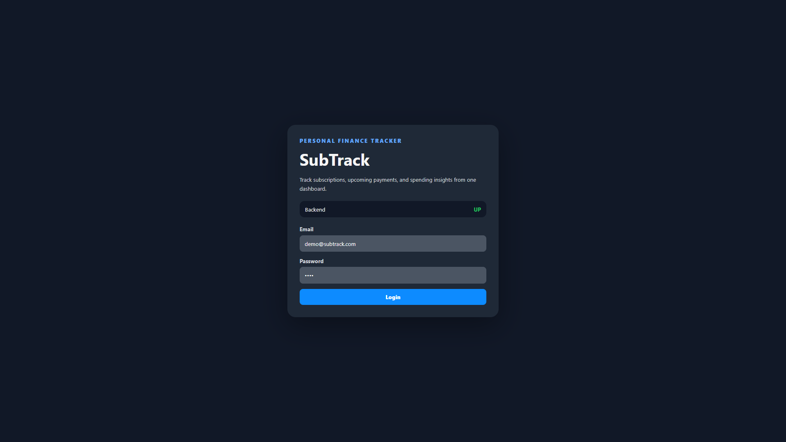
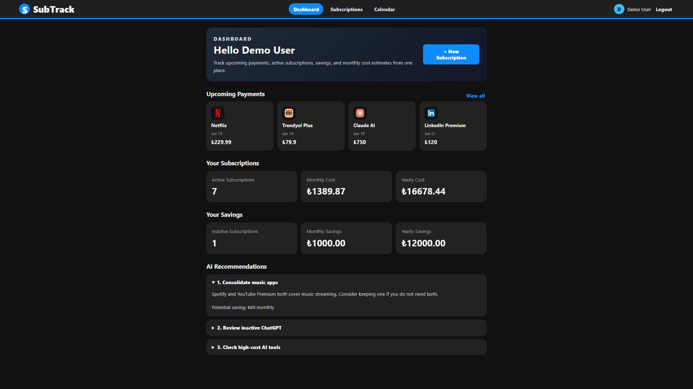
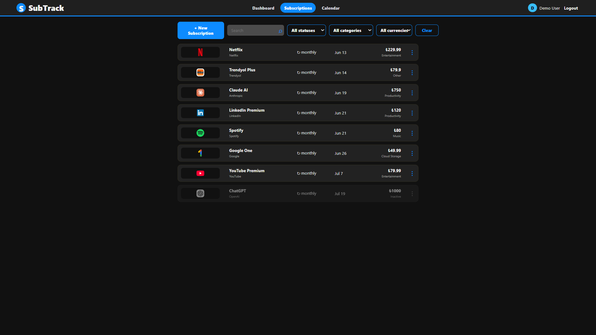
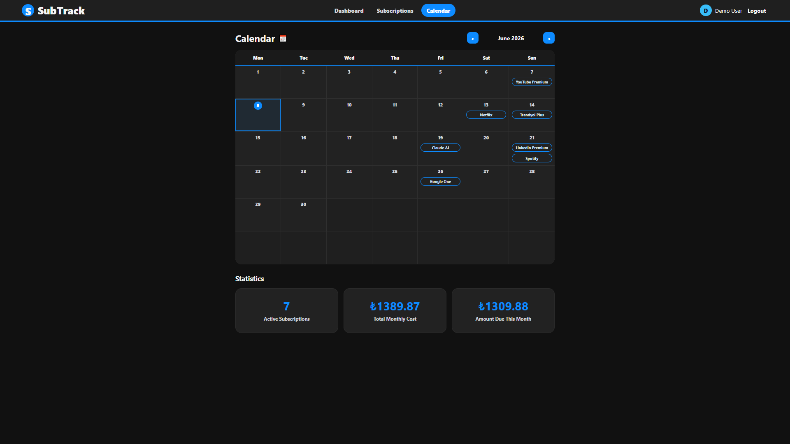

 # SubTrack - Personal Finance & Subscription Tracker

SubTrack is a full-stack personal finance and subscription tracking application. It helps users track recurring subscriptions, upcoming payments, inactive subscriptions, spending summaries, and AI-based saving recommendations from one dashboard.

This project was built as a portfolio project using Spring Boot, React, PostgreSQL, JWT authentication, Flyway migrations, Docker-based backend deployment, and a cloud-hosted frontend/backend/database setup.

---

## Live Demo

Frontend:

```text
https://personal-finance-tracker-v2.vercel.app
```

Backend Health Check:

```text
https://subtrack-backend-9jdt.onrender.com/api/health
```

> Note: The backend is hosted on Render Free Tier. If the service has been inactive, the first request may take some time because the backend may need to wake up.

---

## Demo Account

You can try the application without creating an account:

```text
Email: demo@subtrack.com
Password: demo
```

The demo account is automatically created by the backend on startup and includes sample subscription data.

For the demo account, AI recommendations are hardcoded to avoid consuming Gemini API quota.

---

## Screenshots

### Login



### Dashboard



### Subscriptions



### Calendar



## Features

### Authentication

* JWT-based login
* Protected backend endpoints
* Password hashing with BCrypt
* Current user detection from JWT context
* Backend register endpoint exists, but the deployed portfolio version uses a demo account instead of a register UI

### Dashboard

* Active subscription count
* Monthly cost estimate
* Yearly cost estimate
* Inactive subscription savings
* Upcoming payments
* AI recommendations

### Subscription Management

Users can:

* View subscriptions
* Create subscriptions
* Edit subscriptions
* Delete subscriptions
* Disable subscriptions
* Filter subscriptions by status, category, and currency
* View inactive subscriptions lower in the list

Each subscription can include:

* Name
* Provider
* Price
* Currency
* Billing cycle
* Status
* Start date
* Next payment date
* Auto-renew setting
* Reminder settings
* Category
* Payment method
* Website URL
* Notes

### Website URL and Logos

* Users can add website URLs to subscriptions
* Backend normalizes URLs
  Example: `youtube.com` becomes `https://youtube.com`
* Frontend displays favicon-based subscription logos
* If favicon is not available, the UI falls back to the first letter of the subscription name

### Global Reference Data

The following data is global and shared across users:

* Currencies
* Categories
* Payment methods

Subscriptions are user-owned.

### Calendar

* Shows subscription payment dates
* Highlights today
* Helps users track upcoming renewals

### AI Recommendations

* Gemini API integration for normal users
* Structured response format with title, description, and saving fields
* Fallback recommendations when Gemini API key is missing or the API call fails
* Hardcoded recommendations for the demo user to avoid API quota usage

Example response format:

```json
{
  "recommendations": [
    {
      "title": "Short title",
      "description": "Recommendation detail",
      "saving": "Potential saving"
    }
  ]
}
```

### Security and Error Handling

* JWT authentication
* Protected subscription endpoints
* IDOR-safe subscription access using subscription ID and current user ID
* Global exception handling
* Duplicate resource handling
* Unauthorized access handling
* Resource not found handling

---

## Tech Stack

### Backend

* Java 17
* Spring Boot 3.5.14
* Spring Web
* Spring Security
* Spring Data JPA
* PostgreSQL
* Flyway
* JWT
* Maven
* JUnit
* Mockito
* Docker

### Frontend

* React
* Vite
* Axios
* CSS

### Database

* PostgreSQL 16
* Flyway migrations

### Deployment

* Frontend: Vercel
* Backend: Render Web Service
* Backend runtime: Docker container
* Database: Render PostgreSQL

---

## Architecture Overview

```text
User Browser
    |
    |  React + Vite frontend
    v
Vercel Frontend
    |
    |  HTTPS API requests with JWT
    v
Render Backend
    |
    |  Spring Boot REST API
    |  Docker container
    v
Render PostgreSQL
```

---

## Project Structure

```text
personal-finance-tracker-v2/
├── backend/
│   ├── Dockerfile
│   ├── pom.xml
│   ├── src/main/java/com/subtrack/backend/
│   │   ├── ai/
│   │   ├── auth/
│   │   ├── category/
│   │   ├── config/
│   │   ├── currency/
│   │   ├── health/
│   │   ├── paymentmethod/
│   │   ├── shared/
│   │   ├── subscription/
│   │   └── user/
│   ├── src/main/resources/
│   │   ├── application.properties
│   │   └── db/migration/
│   └── src/test/java/com/subtrack/backend/
│
├── frontend/
│   ├── package.json
│   ├── vite.config.js
│   └── src/
│
├── docker-compose.yml
└── README.md
```

---

## Local Development Setup

### Prerequisites

Make sure these are installed:

* Java 17
* Node.js
* Docker Desktop
* Git

---

## 1. Clone the Repository

```bash
git clone https://github.com/aylgny/personal-finance-tracker-v2.git
cd personal-finance-tracker-v2
```

---

## 2. Start PostgreSQL Locally

From the project root:

```bash
docker compose up -d
```

This starts PostgreSQL with:

```text
Database: subtrack_db
Username: subtrack_user
Password: subtrack_password
Port: 5432
```

---

## 3. Run the Backend

Go to the backend folder:

```bash
cd backend
```

Run the Spring Boot application:

```bash
./mvnw spring-boot:run
```

On Windows PowerShell:

```powershell
.\mvnw.cmd spring-boot:run
```

Backend runs on:

```text
http://localhost:8080
```

Health check:

```http
GET http://localhost:8080/api/health
```

---

## 4. Run the Frontend

Open a new terminal and go to the frontend folder:

```bash
cd frontend
```

Install dependencies:

```bash
npm install
```

Start the frontend:

```bash
npm run dev
```

Frontend runs on:

```text
http://localhost:5173
```

---

## Environment Variables

### Backend Environment Variables

The backend supports environment-based configuration:

```text
PORT
SPRING_DATASOURCE_URL
SPRING_DATASOURCE_USERNAME
SPRING_DATASOURCE_PASSWORD
JWT_SECRET
JWT_EXPIRATION_MS
GEMINI_API_KEY
GEMINI_API_URL
FRONTEND_URL
```

Local default values are defined in:

```text
backend/src/main/resources/application.properties
```

### Frontend Environment Variables

The frontend uses:

```text
VITE_API_BASE_URL
```

Local default:

```text
http://localhost:8080
```

Production example:

```text
VITE_API_BASE_URL=https://subtrack-backend-9jdt.onrender.com
```

---

## API Overview

### Health

```http
GET /api/health
```

### Auth

```http
POST /api/auth/login
POST /api/auth/register
```

Demo login request:

```json
{
  "email": "demo@subtrack.com",
  "password": "demo"
}
```

### Subscriptions

```http
GET /api/subscriptions
POST /api/subscriptions
PUT /api/subscriptions/{id}
DELETE /api/subscriptions/{id}
```

### Reference Data

```http
GET /api/currencies
GET /api/categories
GET /api/payment-methods
```

### AI

```http
GET /api/ai/recommendations
```

---

## Testing

Run backend tests:

```bash
cd backend
./mvnw clean test
```

On Windows PowerShell:

```powershell
cd backend
.\mvnw.cmd clean test
```

Run frontend build:

```bash
cd frontend
npm run build
```

---

## Docker Backend Deployment

The backend includes a Dockerfile:

```text
backend/Dockerfile
```

The Dockerfile uses a multi-stage build:

1. Maven + Java 17 image builds the Spring Boot jar
2. Java 17 JRE image runs the final jar

This allows the backend to run as a Docker container on Render.

---

## Branch Workflow

The project uses a branch-based workflow:

```text
develop -> feature branches -> pull request -> develop
main -> production deployment branch
```

Typical feature flow:

```bash
git checkout develop
git pull origin develop
git checkout -b feature/feature-name
```

After completing a feature:

```bash
git add .
git commit -m "Meaningful commit message"
git push -u origin feature/feature-name
```

Then open a pull request into:

```text
develop
```

For production deployment, `develop` is merged into `main`.

---

## Current Status

Implemented:

* Backend scaffold
* Health endpoint
* JWT authentication
* Global exception handling
* Subscription CRUD
* IDOR-safe subscription access
* Global reference data APIs
* Website URL support
* Favicon-based subscription logos
* Dashboard
* Subscription filters
* Calendar
* AI recommendations
* Demo user seed data
* Demo user hardcoded recommendations
* Backend tests
* Docker backend deployment
* Render backend deployment
* Render PostgreSQL database
* Vercel frontend deployment

---

## Future Improvements

Possible future improvements:

* Add screenshots to README
* Add frontend tests with React Testing Library or Vitest
* Add refresh token support
* Add email reminder system
* Add spending analytics charts
* Add export to CSV
* Add user settings page
* Improve mobile responsiveness
* Add CI/CD pipeline for production deployment

---

## Author

Aylin Günay

GitHub: [@aylgny](https://github.com/aylgny)

